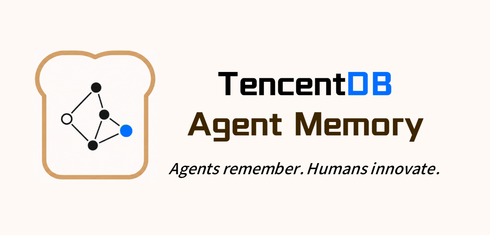

<div align="center">
  
  <h1>Aeon Memory</h1>
  <p><strong>让每个 Agent 都拥有可追溯、可迁移、真正属于用户的长期记忆。</strong></p>
Rust、SQLite、OpenCode 及所有依赖项目的维护者。
Rust、SQLite、OpenCode 及所有依赖项目的维护者。
[](https://github.com/HuChundong/aeon-memory/actions/workflows/pr-ci.yml)
[](https://github.com/HuChundong/aeon-memory/actions/workflows/release.yml)
[](https://github.com/HuChundong/aeon-memory/releases)
[](https://www.npmjs.com/package/@aeon-memory/opencode)
[](LICENSE)
[](https://www.rust-lang.org/)
[](https://opencode.ai/)

[简体中文](README.md) · [English](README_EN.md) · [上游项目](https://github.com/TencentCloud/TencentDB-Agent-Memory)
</div>

Aeon Memory 是一个独立、轻量、跨平台的 Agent 记忆服务。它使用 Rust 重实现
[TencentDB Agent Memory](https://github.com/TencentCloud/TencentDB-Agent-Memory) 的核心
L0 → L1 → L2 → L3 分层记忆与上下文卸载逻辑，提供原生 CLI、严格限制为 10 个应用
接口的 HTTP 服务，以及可通过 npm 一键安装的 OpenCode 插件。运行服务不需要 Node.js、
OpenClaw 或 Docker。

> [!IMPORTANT]
> Aeon Memory 是社区独立维护的兼容实现，并非腾讯或腾讯云官方产品。我们衷心感谢
> TencentDB Agent Memory 的维护者与贡献者创造并开源分层记忆体系。完整归属与第三方
> 声明见 [THIRD_PARTY_NOTICES.md](THIRD_PARTY_NOTICES.md)。

## 为什么是 Aeon Memory

- **分层而不是平铺**：L0 原始对话 → L1 结构化事实 → L2 场景块 → L3 用户画像，
  保留证据链并逐层提炼。
- **一个核心，两种入口**：`aeon-memory` 直接操作本地数据；`aeon-memory-server`
  提供稳定 HTTP 边界，二者共用相同 Rust 核心。
- **本地优先**：默认数据目录为 `~/.aeon-memory/data`，SQLite、FTS5 和 sqlite-vec
  均运行在本机；仅 LLM 和可选 Embedding 调用所配置的兼容端点。
- **跨平台单服务**：Linux、macOS、Windows 原生构建；Docker 只是可选部署方式。
- **宿主无关**：HTTP API 不绑定特定 Agent；目前提供经过测试的 OpenCode 自动集成。
- **可验证兼容**：保留 TypeScript 上游基线、差分测试矩阵与经批准差异清单。

## 记忆架构

```text
Agent / CLI / HTTP client
          │
          ▼
┌───────────────────────────────┐
│ Aeon Memory Core              │
│ L0 Conversation  原始对话      │
│       ↓                        │
│ L1 Atom          结构化事实     │
│       ↓                        │
│ L2 Scenario      场景归纳       │
│       ↓                        │
│ L3 Persona       用户画像       │
└───────────────────────────────┘
          │
          ├── JSONL / Markdown（可读、可追溯）
          └── SQLite + FTS5 + sqlite-vec（关键词/向量/混合检索）
```

LLM 是记忆提取和分层管线的必需依赖。Embedding 是推荐但可选的增强：禁用后仍可记录
L0、运行 L0 → L3 管线并进行 FTS 关键词检索；启用后可使用向量去重和混合召回。

## 五分钟启动

### 方式 A：下载原生 Release（推荐）

从 [GitHub Releases](https://github.com/HuChundong/aeon-memory/releases) 下载当前平台包和
同级 `SHA256SUMS`。支持：

| 系统 | 架构 | 归档 |
|---|---|---|
| Linux | x86_64 / ARM64 | `.tar.gz` |
| macOS | Intel / Apple Silicon | `.tar.gz` |
| Windows | x86_64 | `.zip` |

每个原生包包含 `aeon-memory`、`aeon-memory-server`、对应平台的 sqlite-vec、完整配置
示例、许可证和校验和。发布包中的 sqlite-vec 固定为已校验版本，不在启动时联网下载。

```bash
# Linux
sha256sum -c SHA256SUMS

# macOS
shasum -a 256 -c SHA256SUMS
```

解压后复制配置并至少填写 LLM：

```bash
cp aeon-memory.example.yaml aeon-memory.yaml
```

```yaml
server:
  host: "127.0.0.1"
  port: 8420
  apiKey: "请替换为强随机令牌"
  corsOrigins: []

llm:
  baseUrl: "https://你的-OpenAI-兼容服务/v1"
  apiKey: "你的-LLM-密钥"
  model: "你的聊天模型"
  maxTokens: 4096
  timeoutMs: 120000

memory:
  timezone: "system"
  storeBackend: "sqlite"
  recall:
    enabled: true
    strategy: "hybrid"
    maxResults: 5
    scoreThreshold: 0.3
  embedding:
    enabled: true
    provider: "openai"
    baseUrl: "http://127.0.0.1:1234/v1"
    apiKey: "本地服务不鉴权时可留空"
    model: "你的向量模型"
    dimensions: 1024
    sendDimensions: false
  offload:
    enabled: false
```

`dimensions` 必须与模型真实输出和已有数据库一致。若暂时没有向量模型，将
`memory.embedding.enabled` 设为 `false`，并把召回策略设为 `keyword`。

启动服务：

```bash
./aeon-memory-server --config ./aeon-memory.yaml
curl http://127.0.0.1:8420/health
```

Windows PowerShell：

```powershell
.\aeon-memory-server.exe --config .\aeon-memory.yaml
Invoke-RestMethod http://127.0.0.1:8420/health
```

健康检查返回 HTTP 200 和 `"status":"ok"` 代表本地核心初始化成功；它不会主动探测
远程 LLM 或 Embedding 服务。

### 方式 B：从源码构建

需要 Rust 1.85+、Node.js 22+（仅用于插件和兼容测试）以及 Git：

```bash
git clone https://github.com/HuChundong/aeon-memory.git
cd aeon-memory
cargo build --locked --release --bins
cp config/aeon-memory.example.yaml aeon-memory.yaml
./target/release/aeon-memory-server --config ./aeon-memory.yaml
```

源码开发时需自行提供本平台 sqlite-vec 扩展，或使用 Release 包中的对应文件。扩展发现
顺序、源码测试和打包细节见 [完整中文手册](README_CN.md)。

## CLI：无需启动服务

CLI 和 HTTP 服务是同一核心的两个替代入口。CLI 不是 HTTP 客户端，因此可以不启动
服务直接使用；但不要让 CLI 与服务同时打开同一个数据目录。

```bash
aeon-memory --config aeon-memory.yaml status
aeon-memory --config aeon-memory.yaml capture \
  --user '我偏好中文回答' --assistant '已记住' --session-key demo
aeon-memory --config aeon-memory.yaml recall \
  --query '我的回答偏好是什么？' --session-key demo
aeon-memory --config aeon-memory.yaml search memories --query '中文' --limit 5
aeon-memory --config aeon-memory.yaml search conversations --query '偏好' --limit 10
aeon-memory --config aeon-memory.yaml session end --session-key demo
aeon-memory --config aeon-memory.yaml show persona
aeon-memory --config aeon-memory.yaml show scenes
```

## OpenCode 集成

先确保 `aeon-memory-server` 正在运行，然后安装 npm 插件：

```bash
npx @aeon-memory/opencode@latest install
npx @aeon-memory/opencode@latest status
```

重启 OpenCode 后生效。安装器会使用 OpenCode 标准全局插件配置，保留已有配置，并写入
`~/.config/opencode/opencode.json`：

```json
{
  "plugin": [
    [
      "@aeon-memory/opencode",
      {
        "enabled": true,
        "gatewayUrl": "http://127.0.0.1:8420",
        "apiKey": "与 server.apiKey 相同",
        "recallTimeoutMs": 5000,
        "captureTimeoutMs": 10000,
        "sessionEndTimeoutMs": 120000,
        "offloadEnabled": false
      }
    ]
  ]
}
```

插件会在用户轮次前自动召回、在助手回复完成后自动记录，并在真正删除会话或 OpenCode
实例退出时排空记忆管线。它只读取插件 tuple 配置，不读取模型 Provider 密钥或运行时环境
变量。完整配置、生命周期与卸载方式见
[OpenCode 插件文档](integrations/opencode/README.md)。

```bash
npx @aeon-memory/opencode@latest uninstall
```

## HTTP API

应用层严格保持 10 个接口。`GET /health` 无需鉴权；设置 `server.apiKey` 后，其余接口需
发送 `Authorization: Bearer <token>`。

| 方法 | 路径 | 用途 |
|---|---|---|
| GET | `/health` | 本地核心健康状态 |
| POST | `/recall` | 生成当前轮次稳定上下文 |
| POST | `/capture` | 提交一轮 L0 对话并调度管线 |
| POST | `/search/memories` | 搜索 L1 记忆 |
| POST | `/search/conversations` | 搜索 L0 原始对话 |
| POST | `/session/end` | 排空指定会话待处理任务 |
| POST | `/seed` | 导入历史对话 |
| POST | `/offload/before-prompt` | 提示词前上下文卸载 |
| POST | `/offload/after-tool` | 工具调用后上下文卸载 |
| POST | `/offload/llm-output` | 模型输出边界处理 |

```bash
curl -sS http://127.0.0.1:8420/recall \
  -H 'Content-Type: application/json' \
  -H "Authorization: Bearer $AEON_MEMORY_API_KEY" \
  -d '{"query":"用户偏好是什么？","session_key":"demo"}'
```

请求与响应边界、Offload DTO 见 [OFFLOAD_API_CONTRACT.md](OFFLOAD_API_CONTRACT.md)。

## 数据、备份与安全

默认数据目录：`~/.aeon-memory/data`。优先级为：

```text
AEON_MEMORY_DATA_DIR > data.baseDir > ~/.aeon-memory/data
```

目录包含 `conversations/`、`vectors.db`、`scene_blocks/`、`persona.md` 和 `.metadata/`。
备份前停止服务并复制完整目录；不要只复制 SQLite 主文件而遗漏 WAL。升级前务必备份。

仅本机使用时保持 `server.host: 127.0.0.1`。监听非回环地址前必须设置强
`server.apiKey`，并配置防火墙、TLS 反向代理和最小 CORS 白名单。配置文件与记忆数据均
可能含敏感信息，不应提交 Git。安全问题请按 [SECURITY.md](SECURITY.md) 私密报告。

## 兼容性与已知边界

本项目目标是保持上游核心语义，而不是继续依赖上游的 OpenClaw/Node.js 宿主实现。
兼容性证据与边界记录在：

- [TEST_PARITY_MATRIX.md](TEST_PARITY_MATRIX.md)：上游 TypeScript 与 Rust 测试映射；
- [TS_DIFFERENTIAL_BASELINE.md](TS_DIFFERENTIAL_BASELINE.md)：差分测试基线；
- [APPROVED_DIFFERENCES.md](APPROVED_DIFFERENCES.md)：经确认的语言/宿主差异；
- [DIFFERENTIAL_E2E.md](DIFFERENTIAL_E2E.md)：双实现端到端验证方法。

在兼容性测试未覆盖的边缘行为上，请先提交可复现用例，再讨论是否属于缺陷。Aeon Memory
不会使用腾讯商标暗示官方关系，也不复制上游的 Benchmark 成绩作为本实现成绩。

## 开发与验证

```bash
cargo fmt --all -- --check
cargo clippy --workspace --all-targets --locked -- -D warnings
cargo test --workspace --locked
cargo build --workspace --locked --release --bins

cd integrations/opencode
npm ci
npm run typecheck
npm test
npm run pack:check
```

CI 在 Linux、macOS、Windows 上运行 Rust 测试，并单独验证 OpenCode 插件、数据工具和
npm tarball。创建 `vX.Y.Z` 标签时，Release 工作流要求 Cargo workspace 与 npm 插件版本
都等于 `X.Y.Z`，随后构建五个平台原生包、发布 GitHub Release，并通过 npm Trusted
Publishing 发布 `@aeon-memory/opencode`。

维护者发布前请阅读 [RELEASING.md](RELEASING.md)。普通贡献请阅读
[CONTRIBUTING.md](CONTRIBUTING.md) 和 [行为准则](CODE_OF_CONDUCT.md)。

## 项目状态

Aeon Memory 当前处于早期公开版本。核心服务、CLI、HTTP API 和 OpenCode 集成已有自动化
测试，但在生产使用前仍应进行备份、容量评估、模型兼容验证和故障恢复演练。版本遵循
[Semantic Versioning](https://semver.org/)，变更见 [CHANGELOG.md](CHANGELOG.md)。

## 许可证与致谢

Aeon Memory 采用 [MIT License](LICENSE)。衍生部分保留 TencentDB Agent Memory 的原始
版权与许可声明；sqlite-vec 等组件仍遵循各自许可证，详见
[THIRD_PARTY_NOTICES.md](THIRD_PARTY_NOTICES.md)。

再次感谢 [TencentDB Agent Memory](https://github.com/TencentCloud/TencentDB-Agent-Memory)
团队和贡献者对 Agent 分层记忆与符号化上下文卸载的开创性实现，也感谢 sqlite-vec、
Rust、SQLite、OpenCode 及所有依赖项目的维护者。
